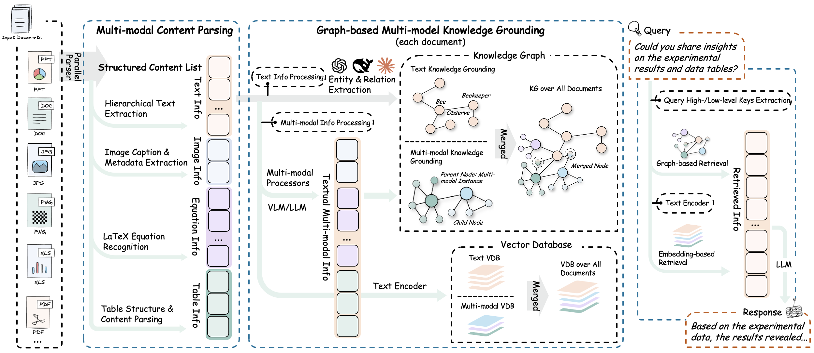

<div align="center">

<div style="margin: 20px 0;">
  
</div>

# 🚀 RAG-Anything: All-in-One RAG System

<div align="center">
  <div style="width: 100%; height: 2px; margin: 20px 0; background: linear-gradient(90deg, transparent, #00d9ff, transparent);"></div>
</div>

<div align="center">
  <div style="background: linear-gradient(135deg, #667eea 0%, #764ba2 100%); border-radius: 15px; padding: 25px; text-align: center;">
    <p>
      <a href='https://github.com/HKUDS/RAG-Anything'></a>
      <a href='https://arxiv.org/abs/2510.12323'></a>
      <a href='https://github.com/HKUDS/LightRAG'></a>
    </p>
    <p>
      <a href="https://github.com/HKUDS/RAG-Anything/stargazers"></a>
      
      <a href="https://pypi.org/project/raganything/"></a>
    </p>
    <p>
      <a href="https://discord.gg/yF2MmDJyGJ"></a>
      <a href="https://github.com/HKUDS/RAG-Anything/issues/7"></a>
    </p>
    <p>
      <a href="README_zh.md"></a>
      <a href="README.md"></a>
    </p>
  </div>
</div>

</div>

<div align="center" style="margin: 30px 0;">
  
</div>

<div align="center">
  <a href="#-快速开始" style="text-decoration: none;">
    
  </a>
</div>

---

<div align="center">
  <table>
    <tr>
      <td style="vertical-align: middle;">
        
      </td>
      <td style="vertical-align: middle; padding-left: 12px;">
        <a href="https://litewrite.ai">
          
        </a>
      </td>
    </tr>
  </table>
</div>

---

## 🎉 新闻
- [X] [2026.06]🎯📢 🎉 [LightRAG](https://github.com/HKUDS/LightRAG) 通过原生集成 RAG-Anything 实现多模态 RAG。
- [X] [2025.10]🎯📢 🚀 我们已发布 [RAG-Anything] 的技术报告（http://arxiv.org/abs/2510.12323），立即访问以了解我们的最新研究成果。
- [X] [2025.08.12]🎯📢 🔍 RAGAnything 现在支持 **VLM增强查询** 模式！当文档包含图片时，系统可以自动将图片与文本上下文一起直接传递给VLM进行综合多模态分析。
- [X] [2025.07.05]🎯📢 RAGAnything 新增[上下文配置模块](docs/context_aware_processing.md)，支持为多模态内容处理添加相关上下文信息。
- [X] [2025.07.04]🎯📢 RAGAnything 现在支持多模态内容查询，实现了集成文本、图像、表格和公式处理的增强检索生成功能。
- [X] [2025.07.03]🎯📢 RAGAnything 在GitHub上达到了1K星标🌟！感谢您的支持和贡献。

---

## 🌟 系统概述

*下一代多模态智能*

<div style="background: linear-gradient(135deg, #1a1a2e 0%, #16213e 50%, #0f3460 100%); border-radius: 15px; padding: 25px; margin: 20px 0; border: 2px solid #00d9ff; box-shadow: 0 0 30px rgba(0, 217, 255, 0.3);">

**RAG-Anything**是一个综合性多模态文档处理RAG系统。该系统能够无缝处理和查询包含文本、图像、表格、公式等多模态内容的复杂文档，提供完整的检索增强(RAG)生成解决方案。



</div>

### 🎯 核心特性

<div style="background: linear-gradient(135deg, #1a1a2e 0%, #16213e 100%); border-radius: 15px; padding: 25px; margin: 20px 0;">

- **🔄 端到端多模态处理流水线** - 提供从文档解析到多模态查询响应的完整处理链路，确保系统的一体化运行
- **📄 多格式文档支持** - 支持PDF、Office文档（DOC/DOCX/PPT/PPTX/XLS/XLSX）、图像等主流文档格式的统一处理和解析
- **🧠 多模态内容分析引擎** - 针对图像、表格、公式和通用文本内容部署专门的处理器，确保各类内容的精准解析
- **🔗 基于知识图谱索引** - 实现自动化实体提取和关系构建，建立跨模态的语义连接网络
- **⚡ 灵活的处理架构** - 支持基于MinerU的智能解析模式和直接多模态内容插入模式，满足不同应用场景需求
- **📋 直接内容列表插入** - 跳过文档解析，直接插入来自外部源的预解析内容列表，支持多种数据来源整合
- **🎯 跨模态检索机制** - 实现跨文本和多模态内容的智能检索，提供精准的信息定位和匹配能力

</div>

---

## 🏗️ 算法原理与架构

<div style="background: linear-gradient(135deg, #0f0f23 0%, #1a1a2e 100%); border-radius: 15px; padding: 25px; margin: 20px 0; border-left: 5px solid #00d9ff;">

### 核心算法

**RAG-Anything** 采用灵活的分层架构设计，实现多阶段多模态处理流水线，将传统RAG系统扩展为支持异构内容类型的综合处理平台。

</div>

<div align="center">
  <div style="width: 100%; max-width: 600px; margin: 20px auto; padding: 20px; background: linear-gradient(135deg, rgba(0, 217, 255, 0.1) 0%, rgba(0, 217, 255, 0.05) 100%); border-radius: 15px; border: 1px solid rgba(0, 217, 255, 0.2);">
    <div style="display: flex; justify-content: space-around; align-items: center; flex-wrap: wrap; gap: 20px;">
      <div style="text-align: center;">
        <div style="font-size: 24px; margin-bottom: 10px;">📄</div>
        <div style="font-size: 14px; color: #00d9ff;">文档解析</div>
      </div>
      <div style="font-size: 20px; color: #00d9ff;">→</div>
      <div style="text-align: center;">
        <div style="font-size: 24px; margin-bottom: 10px;">🧠</div>
        <div style="font-size: 14px; color: #00d9ff;">内容分析</div>
      </div>
      <div style="font-size: 20px; color: #00d9ff;">→</div>
      <div style="text-align: center;">
        <div style="font-size: 24px; margin-bottom: 10px;">🔍</div>
        <div style="font-size: 14px; color: #00d9ff;">知识图谱</div>
      </div>
      <div style="font-size: 20px; color: #00d9ff;">→</div>
      <div style="text-align: center;">
        <div style="font-size: 24px; margin-bottom: 10px;">🎯</div>
        <div style="font-size: 14px; color: #00d9ff;">智能检索</div>
      </div>
    </div>
  </div>
</div>

### 1. 文档解析阶段

<div style="background: linear-gradient(90deg, #1a1a2e 0%, #16213e 100%); border-radius: 10px; padding: 20px; margin: 15px 0; border-left: 4px solid #4ecdc4;">

该系统构建了高精度文档解析平台，通过结构化提取引擎实现多模态元素的完整识别与提取。系统采用自适应内容分解机制，智能分离文档中的文本、图像、表格、公式等异构内容，并保持其语义关联性。同时支持PDF、Office文档、图像等主流格式的统一处理，提供标准化的多模态内容输出。

**核心组件：**

- **⚙️ 结构化提取引擎**：集成 [MinerU](https://github.com/opendatalab/MinerU) 文档解析框架，实现精确的文档结构识别与内容提取，确保多模态元素的完整性和准确性。

- **🧩 自适应内容分解机制**：建立智能内容分离系统，自动识别并提取文档中的文本块、图像、表格、公式等异构元素，保持元素间的语义关联关系。

- **📁 多格式兼容处理**：部署专业化解析器矩阵，支持PDF、Office文档系列（DOC/DOCX/PPT/PPTX/XLS/XLSX）、图像等主流格式的统一处理与标准化输出。

</div>

### 2. 多模态内容理解与处理

<div style="background: linear-gradient(90deg, #16213e 0%, #0f3460 100%); border-radius: 10px; padding: 20px; margin: 15px 0; border-left: 4px solid #ff6b6b;">

该多模态内容处理系统通过自主分类路由机制实现异构内容的智能识别与优化分发。系统采用并发多流水线架构，确保文本和多模态内容的高效并行处理，在最大化吞吐量的同时保持内容完整性，并能完整提取和保持原始文档的层次结构与元素关联关系。

**核心组件：**

- **🎯 自主内容分类与路由**：自动识别、分类并将不同内容类型路由至优化的执行通道。

- **⚡ 并发多流水线架构**：通过专用处理流水线实现文本和多模态内容的并发执行。这种方法在保持内容完整性的同时最大化吞吐效率。

- **🏗️ 文档层次结构提取**：在内容转换过程中提取并保持原始文档的层次结构和元素间关系。

</div>

### 3. 多模态分析引擎

<div style="background: linear-gradient(90deg, #0f3460 0%, #1a1a2e 100%); border-radius: 10px; padding: 20px; margin: 15px 0; border-left: 4px solid #00d9ff;">

系统部署了面向异构数据模态的模态感知处理单元：

**专用分析器：**

- **🔍 视觉内容分析器**：
  - 集成视觉模型进行图像分析和内容识别
  - 基于视觉语义生成上下文感知的描述性标题
  - 提取视觉元素间的空间关系和层次结构

- **📊 结构化数据解释器**：
  - 对表格和结构化数据格式进行系统性解释
  - 实现数据趋势分析的统计模式识别算法
  - 识别多个表格数据集间的语义关系和依赖性

- **📐 数学表达式解析器**：
  - 高精度解析复杂数学表达式和公式
  - 提供原生LaTeX格式支持以实现与学术工作流的无缝集成
  - 建立数学方程与领域特定知识库间的概念映射

- **🔧 可扩展模态处理器**：
  - 为自定义和新兴内容类型提供可配置的处理框架
  - 通过插件架构实现新模态处理器的动态集成
  - 支持专用场景下处理流水线的运行时配置

</div>

### 4. 多模态知识图谱索引

<div style="background: linear-gradient(90deg, #1a1a2e 0%, #16213e 100%); border-radius: 10px; padding: 20px; margin: 15px 0; border-left: 4px solid #4ecdc4;">

多模态知识图谱构建模块将文档内容转换为结构化语义表示。系统提取多模态实体，建立跨模态关系，并保持层次化组织结构。通过加权相关性评分实现优化的知识检索。

**核心功能：**

- **🔍 多模态实体提取**：将重要的多模态元素转换为结构化知识图谱实体。该过程包括语义标注和元数据保存。

- **🔗 跨模态关系映射**：在文本实体和多模态组件之间建立语义连接和依赖关系。通过自动化关系推理算法实现这一功能。

- **🏗️ 层次结构保持**：通过"归属于"关系链维护原始文档组织结构。这些关系链保持逻辑内容层次和章节依赖关系。

- **⚖️ 加权关系评分**：为关系类型分配定量相关性分数。评分基于语义邻近性和文档结构内的上下文重要性。

</div>

### 5. 模态感知检索

<div style="background: linear-gradient(90deg, #16213e 0%, #0f3460 100%); border-radius: 10px; padding: 20px; margin: 15px 0; border-left: 4px solid #ff6b6b;">

混合检索系统结合向量相似性搜索与图遍历算法，实现全面的内容检索。系统实现模态感知排序机制，并维护检索元素间的关系一致性，确保上下文集成的信息传递。

**检索机制：**

- **🔀 向量-图谱融合**：集成向量相似性搜索与图遍历算法。该方法同时利用语义嵌入和结构关系实现全面的内容检索。

- **📊 模态感知排序**：实现基于内容类型相关性的自适应评分机制。系统根据查询特定的模态偏好调整排序结果。

- **🔗 关系一致性维护**：维护检索元素间的语义和结构关系。确保信息传递的连贯性和上下文完整性。

</div>

---

## 🚀 快速开始

*启动您的AI之旅*

<div align="center">
  
</div>

### 安装

#### 选项1：从PyPI安装（推荐）

```bash
# 基础安装
pip install raganything

# 安装包含扩展格式支持的可选依赖：
pip install 'raganything[all]'              # 所有可选功能
pip install 'raganything[image]'            # 图像格式转换 (BMP, TIFF, GIF, WebP)
pip install 'raganything[text]'             # 文本文件处理 (TXT, MD)
pip install 'raganything[image,text]'       # 多个功能组合
```

#### 选项2：从源码安装

```bash
git clone https://github.com/HKUDS/RAG-Anything.git
cd RAG-Anything
pip install -e .

# 安装可选依赖
pip install -e '.[all]'
```

#### 可选依赖

- **`[image]`** - 启用BMP、TIFF、GIF、WebP图像格式处理（需要Pillow）
- **`[text]`** - 启用TXT和MD文件处理（需要ReportLab）
- **`[all]`** - 包含所有Python可选依赖

> **⚠️ Office文档处理配置要求：**
> - Office文档 (.doc, .docx, .ppt, .pptx, .xls, .xlsx) 需要安装 **LibreOffice**
> - 从[LibreOffice官网](https://www.libreoffice.org/download/download/)下载安装
> - **Windows**：从官网下载安装包
> - **macOS**：`brew install --cask libreoffice`
> - **Ubuntu/Debian**：`sudo apt-get install libreoffice`
> - **CentOS/RHEL**：`sudo yum install libreoffice`

**检查MinerU安装：**

```bash
# 验证安装
mineru --version

# 检查是否正确配置
python -c "from raganything import RAGAnything; rag = RAGAnything(); print('✅ MinerU安装正常' if rag.check_parser_installation() else '❌ MinerU安装有问题')"
```

模型在首次使用时自动下载。手动下载参考[MinerU模型源配置](https://github.com/opendatalab/MinerU/blob/master/README_zh-CN.md#22-%E6%A8%A1%E5%9E%8B%E6%BA%90%E9%85%8D%E7%BD%AE)：

### 使用示例

#### 1. 端到端文档处理

```python
import asyncio
from functools import partial
from raganything import RAGAnything, RAGAnythingConfig
from lightrag.llm.openai import openai_complete_if_cache, openai_embed
from lightrag.utils import EmbeddingFunc

async def main():
    # 设置 API 配置
    api_key = "your-api-key"
    base_url = "your-base-url"  # 可选

    # 创建 RAGAnything 配置
    config = RAGAnythingConfig(
        working_dir="./rag_storage",
        parser="mineru",  # 选择解析器：mineru 或 docling
        parse_method="auto",  # 解析方法：auto, ocr 或 txt
        enable_image_processing=True,
        enable_table_processing=True,
        enable_equation_processing=True,
    )

    # 定义 LLM 模型函数
    def llm_model_func(prompt, system_prompt=None, history_messages=[], **kwargs):
        return openai_complete_if_cache(
            "gpt-4o-mini",
            prompt,
            system_prompt=system_prompt,
            history_messages=history_messages,
            api_key=api_key,
            base_url=base_url,
            **kwargs,
        )

    # 定义视觉模型函数用于图像处理
    def vision_model_func(
        prompt, system_prompt=None, history_messages=[], image_data=None, messages=None, **kwargs
    ):
        # 如果提供了messages格式（用于多模态VLM增强查询），直接使用
        if messages:
            return openai_complete_if_cache(
                "gpt-4o",
                "",
                system_prompt=None,
                history_messages=[],
                messages=messages,
                api_key=api_key,
                base_url=base_url,
                **kwargs,
            )
        # 传统单图片格式
        elif image_data:
            return openai_complete_if_cache(
                "gpt-4o",
                "",
                system_prompt=None,
                history_messages=[],
                messages=[
                    {"role": "system", "content": system_prompt}
                    if system_prompt
                    else None,
                    {
                        "role": "user",
                        "content": [
                            {"type": "text", "text": prompt},
                            {
                                "type": "image_url",
                                "image_url": {
                                    "url": f"data:image/jpeg;base64,{image_data}"
                                },
                            },
                        ],
                    }
                    if image_data
                    else {"role": "user", "content": prompt},
                ],
                api_key=api_key,
                base_url=base_url,
                **kwargs,
            )
        # 纯文本格式
        else:
            return llm_model_func(prompt, system_prompt, history_messages, **kwargs)

    # 定义嵌入函数
    embedding_func = EmbeddingFunc(
        embedding_dim=3072,
        max_token_size=8192,
        func=partial(
            openai_embed.func,
            model="text-embedding-3-large",
            api_key=api_key,
            base_url=base_url,
        ),
    )

    # 初始化 RAGAnything
    rag = RAGAnything(
        config=config,
        llm_model_func=llm_model_func,
        vision_model_func=vision_model_func,
        embedding_func=embedding_func,
    )

    # 处理文档
    await rag.process_document_complete(
        file_path="path/to/your/document.pdf",
        output_dir="./output",
        parse_method="auto"
    )

    # 查询处理后的内容
    # 纯文本查询 - 基本知识库搜索
    text_result = await rag.aquery(
        "文档的主要内容是什么？",
        mode="hybrid"
    )
    print("文本查询结果:", text_result)

    # 多模态查询 - 包含具体多模态内容的查询
    multimodal_result = await rag.aquery_with_multimodal(
        "分析这个性能数据并解释与现有文档内容的关系",
        multimodal_content=[{
            "type": "table",
            "table_data": """系统,准确率,F1分数
                            RAGAnything,95.2%,0.94
                            基准方法,87.3%,0.85""",
            "table_caption": "性能对比结果"
        }],
        mode="hybrid"
    )
    print("多模态查询结果:", multimodal_result)

if __name__ == "__main__":
    asyncio.run(main())
```

#### 2. 直接多模态内容处理

```python
import asyncio
from functools import partial
from lightrag import LightRAG
from lightrag.llm.openai import openai_complete_if_cache, openai_embed
from lightrag.utils import EmbeddingFunc
from raganything.modalprocessors import ImageModalProcessor, TableModalProcessor

async def process_multimodal_content():
    # 设置 API 配置
    api_key = "your-api-key"
    base_url = "your-base-url"  # 可选

    # 初始化 LightRAG
    rag = LightRAG(
        working_dir="./rag_storage",
        llm_model_func=lambda prompt, system_prompt=None, history_messages=[], **kwargs: openai_complete_if_cache(
            "gpt-4o-mini",
            prompt,
            system_prompt=system_prompt,
            history_messages=history_messages,
            api_key=api_key,
            base_url=base_url,
            **kwargs,
        ),
        embedding_func=EmbeddingFunc(
            embedding_dim=3072,
            max_token_size=8192,
            func=partial(
                openai_embed.func,
                model="text-embedding-3-large",
                api_key=api_key,
                base_url=base_url,
            ),
        )
    )
    await rag.initialize_storages()

    # 处理图像
    image_processor = ImageModalProcessor(
        lightrag=rag,
        modal_caption_func=lambda prompt, system_prompt=None, history_messages=[], image_data=None, **kwargs: openai_complete_if_cache(
            "gpt-4o",
            "",
            system_prompt=None,
            history_messages=[],
            messages=[
                {"role": "system", "content": system_prompt} if system_prompt else None,
                {"role": "user", "content": [
                    {"type": "text", "text": prompt},
                    {"type": "image_url", "image_url": {"url": f"data:image/jpeg;base64,{image_data}"}}
                ]} if image_data else {"role": "user", "content": prompt}
            ],
            api_key=api_key,
            base_url=base_url,
            **kwargs,
        ) if image_data else openai_complete_if_cache(
            "gpt-4o-mini",
            prompt,
            system_prompt=system_prompt,
            history_messages=history_messages,
            api_key=api_key,
            base_url=base_url,
            **kwargs,
        )
    )

    image_content = {
        "img_path": "path/to/image.jpg",
        "image_caption": ["图1：实验结果"],
        "image_footnote": ["数据收集于2024年"]
    }

    description, entity_info = await image_processor.process_multimodal_content(
        modal_content=image_content,
        content_type="image",
        file_path="research_paper.pdf",
        entity_name="实验结果图表"
    )

    # 处理表格
    table_processor = TableModalProcessor(
        lightrag=rag,
        modal_caption_func=lambda prompt, system_prompt=None, history_messages=[], **kwargs: openai_complete_if_cache(
            "gpt-4o-mini",
            prompt,
            system_prompt=system_prompt,
            history_messages=history_messages,
            api_key=api_key,
            base_url=base_url,
            **kwargs,
        )
    )

    table_content = {
        "table_body": """
        | 方法 | 准确率 | F1分数 |
        |------|--------|--------|
        | RAGAnything | 95.2% | 0.94 |
        | 基准方法 | 87.3% | 0.85 |
        """,
        "table_caption": ["性能对比"],
        "table_footnote": ["测试数据集结果"]
    }

    description, entity_info = await table_processor.process_multimodal_content(
        modal_content=table_content,
        content_type="table",
        file_path="research_paper.pdf",
        entity_name="性能结果表格"
    )

if __name__ == "__main__":
    asyncio.run(process_multimodal_content())
```

#### 3. 批量处理

```python
# 处理多个文档
await rag.process_folder_complete(
    folder_path="./documents",
    output_dir="./output",
    file_extensions=[".pdf", ".docx", ".pptx"],
    recursive=True,
    max_workers=4
)
```

#### 4. 自定义模态处理器

```python
from raganything.modalprocessors import GenericModalProcessor

class CustomModalProcessor(GenericModalProcessor):
    async def process_multimodal_content(self, modal_content, content_type, file_path, entity_name):
        # 你的自定义处理逻辑
        enhanced_description = await self.analyze_custom_content(modal_content)
        entity_info = self.create_custom_entity(enhanced_description, entity_name)
        return await self._create_entity_and_chunk(enhanced_description, entity_info, file_path)
```

#### 5. 查询选项

RAG-Anything 提供三种类型的查询方法：

**纯文本查询** - 使用LightRAG直接进行知识库搜索：
```python
# 文本查询的不同模式
text_result_hybrid = await rag.aquery("你的问题", mode="hybrid")
text_result_local = await rag.aquery("你的问题", mode="local")
text_result_global = await rag.aquery("你的问题", mode="global")
text_result_naive = await rag.aquery("你的问题", mode="naive")

# 同步版本
sync_text_result = rag.query("你的问题", mode="hybrid")
```

**VLM增强查询** - 使用VLM自动分析检索上下文中的图像：
```python
# VLM增强查询（当提供vision_model_func时自动启用）
vlm_result = await rag.aquery(
    "分析文档中的图表和数据",
    mode="hybrid"
    # vlm_enhanced=True 当vision_model_func可用时自动设置
)

# 手动控制VLM增强
vlm_enabled = await rag.aquery(
    "这个文档中的图片显示了什么内容？",
    mode="hybrid",
    vlm_enhanced=True  # 强制启用VLM增强
)

vlm_disabled = await rag.aquery(
    "这个文档中的图片显示了什么内容？",
    mode="hybrid",
    vlm_enhanced=False  # 强制禁用VLM增强
)

# 当文档包含图片时，VLM可以直接查看和分析图片
# 系统将自动：
# 1. 检索包含图片路径的相关上下文
# 2. 加载图片并编码为base64格式
# 3. 将文本上下文和图片一起发送给VLM进行综合分析
```

**多模态查询** - 包含特定多模态内容分析的增强查询：
```python
# 包含表格数据的查询
table_result = await rag.aquery_with_multimodal(
    "比较这些性能指标与文档内容",
    multimodal_content=[{
        "type": "table",
        "table_data": """方法,准确率,速度
                        LightRAG,95.2%,120ms
                        传统方法,87.3%,180ms""",
        "table_caption": "性能对比"
    }],
    mode="hybrid"
)

# 包含公式内容的查询
equation_result = await rag.aquery_with_multimodal(
    "解释这个公式及其与文档内容的相关性",
    multimodal_content=[{
        "type": "equation",
        "latex": "P(d|q) = \\frac{P(q|d) \\cdot P(d)}{P(q)}",
        "equation_caption": "文档相关性概率"
    }],
    mode="hybrid"
)
```

#### 6. 加载已存在的LightRAG实例

```python
import asyncio
from functools import partial
from raganything import RAGAnything
from lightrag import LightRAG
from lightrag.llm.openai import openai_complete_if_cache, openai_embed
from lightrag.utils import EmbeddingFunc
import os

async def load_existing_lightrag():
    # 设置 API 配置
    api_key = "your-api-key"
    base_url = "your-base-url"  # 可选

    # 首先，创建或加载已存在的 LightRAG 实例
    lightrag_working_dir = "./existing_lightrag_storage"

    # 检查是否存在之前的 LightRAG 实例
    if os.path.exists(lightrag_working_dir) and os.listdir(lightrag_working_dir):
        print("✅ 发现已存在的 LightRAG 实例，正在加载...")
    else:
        print("❌ 未找到已存在的 LightRAG 实例，将创建新实例")

    # 使用您的配置创建/加载 LightRAG 实例
    lightrag_instance = LightRAG(
        working_dir=lightrag_working_dir,
        llm_model_func=lambda prompt, system_prompt=None, history_messages=[], **kwargs: openai_complete_if_cache(
            "gpt-4o-mini",
            prompt,
            system_prompt=system_prompt,
            history_messages=history_messages,
            api_key=api_key,
            base_url=base_url,
            **kwargs,
        ),
        embedding_func=EmbeddingFunc(
            embedding_dim=3072,
            max_token_size=8192,
            func=partial(
                openai_embed.func,
                model="text-embedding-3-large",
                api_key=api_key,
                base_url=base_url,
            ),
        )
    )

    # 初始化存储（如果有现有数据，这将加载它们）
    await lightrag_instance.initialize_storages()
    await initialize_pipeline_status()

    # 定义视觉模型函数用于图像处理
    def vision_model_func(
        prompt, system_prompt=None, history_messages=[], image_data=None, messages=None, **kwargs
    ):
        # 如果提供了messages格式（用于多模态VLM增强查询），直接使用
        if messages:
            return openai_complete_if_cache(
                "gpt-4o",
                "",
                system_prompt=None,
                history_messages=[],
                messages=messages,
                api_key=api_key,
                base_url=base_url,
                **kwargs,
            )
        # 传统单图片格式
        elif image_data:
            return openai_complete_if_cache(
                "gpt-4o",
                "",
                system_prompt=None,
                history_messages=[],
                messages=[
                    {"role": "system", "content": system_prompt}
                    if system_prompt
                    else None,
                    {
                        "role": "user",
                        "content": [
                            {"type": "text", "text": prompt},
                            {
                                "type": "image_url",
                                "image_url": {
                                    "url": f"data:image/jpeg;base64,{image_data}"
                                },
                            },
                        ],
                    }
                    if image_data
                    else {"role": "user", "content": prompt},
                ],
                api_key=api_key,
                base_url=base_url,
                **kwargs,
            )
        # 纯文本格式
        else:
            return lightrag_instance.llm_model_func(prompt, system_prompt, history_messages, **kwargs)

    # 现在使用已存在的 LightRAG 实例初始化 RAGAnything
    rag = RAGAnything(
        lightrag=lightrag_instance,  # 传入已存在的 LightRAG 实例
        vision_model_func=vision_model_func,
        # 注意：working_dir、llm_model_func、embedding_func 等都从 lightrag_instance 继承
    )

    # 查询已存在的知识库
    result = await rag.aquery(
        "这个 LightRAG 实例中处理了哪些数据？",
        mode="hybrid"
    )
    print("查询结果:", result)

    # 向已存在的 LightRAG 实例添加新的多模态文档
    await rag.process_document_complete(
        file_path="path/to/new/multimodal_document.pdf",
        output_dir="./output"
    )

if __name__ == "__main__":
    asyncio.run(load_existing_lightrag())
```

#### 7. 直接插入内容列表

当您已经有预解析的内容列表（例如，来自外部解析器或之前的处理结果）时，可以直接插入到 RAGAnything 中而无需文档解析：

```python
import asyncio
from functools import partial
from raganything import RAGAnything, RAGAnythingConfig
from lightrag.llm.openai import openai_complete_if_cache, openai_embed
from lightrag.utils import EmbeddingFunc

async def insert_content_list_example():
    # 设置 API 配置
    api_key = "your-api-key"
    base_url = "your-base-url"  # 可选

    # 创建 RAGAnything 配置
    config = RAGAnythingConfig(
        working_dir="./rag_storage",
        enable_image_processing=True,
        enable_table_processing=True,
        enable_equation_processing=True,
    )

    # 定义模型函数
    def llm_model_func(prompt, system_prompt=None, history_messages=[], **kwargs):
        return openai_complete_if_cache(
            "gpt-4o-mini",
            prompt,
            system_prompt=system_prompt,
            history_messages=history_messages,
            api_key=api_key,
            base_url=base_url,
            **kwargs,
        )

    def vision_model_func(prompt, system_prompt=None, history_messages=[], image_data=None, messages=None, **kwargs):
        # 如果提供了messages格式（用于多模态VLM增强查询），直接使用
        if messages:
            return openai_complete_if_cache(
                "gpt-4o",
                "",
                system_prompt=None,
                history_messages=[],
                messages=messages,
                api_key=api_key,
                base_url=base_url,
                **kwargs,
            )
        # 传统单图片格式
        elif image_data:
            return openai_complete_if_cache(
                "gpt-4o",
                "",
                system_prompt=None,
                history_messages=[],
                messages=[
                    {"role": "system", "content": system_prompt} if system_prompt else None,
                    {
                        "role": "user",
                        "content": [
                            {"type": "text", "text": prompt},
                            {"type": "image_url", "image_url": {"url": f"data:image/jpeg;base64,{image_data}"}}
                        ],
                    } if image_data else {"role": "user", "content": prompt},
                ],
                api_key=api_key,
                base_url=base_url,
                **kwargs,
            )
        # 纯文本格式
        else:
            return llm_model_func(prompt, system_prompt, history_messages, **kwargs)

    embedding_func = EmbeddingFunc(
        embedding_dim=3072,
        max_token_size=8192,
        func=partial(
            openai_embed.func,
            model="text-embedding-3-large",
            api_key=api_key,
            base_url=base_url,
        ),
    )

    # 初始化 RAGAnything
    rag = RAGAnything(
        config=config,
        llm_model_func=llm_model_func,
        vision_model_func=vision_model_func,
        embedding_func=embedding_func,
    )

    # 示例：来自外部源的预解析内容列表
    content_list = [
        {
            "type": "text",
            "text": "这是我们研究论文的引言部分。",
            "page_idx": 0  # 此内容出现的页码
        },
        {
            "type": "image",
            "img_path": "/absolute/path/to/figure1.jpg",  # 重要：使用绝对路径
            "image_caption": ["图1：系统架构"],
            "image_footnote": ["来源：作者原创设计"],
            "page_idx": 1  # 此图像出现的页码
        },
        {
            "type": "table",
            "table_body": "| 方法 | 准确率 | F1分数 |\n|------|--------|--------|\n| 我们的方法 | 95.2% | 0.94 |\n| 基准方法 | 87.3% | 0.85 |",
            "table_caption": ["表1：性能对比"],
            "table_footnote": ["测试数据集结果"],
            "page_idx": 2  # 此表格出现的页码
        },
        {
            "type": "equation",
            "latex": "P(d|q) = \\frac{P(q|d) \\cdot P(d)}{P(q)}",
            "text": "文档相关性概率公式",
            "page_idx": 3  # 此公式出现的页码
        },
        {
            "type": "text",
            "text": "总之，我们的方法在所有指标上都表现出优越的性能。",
            "page_idx": 4  # 此内容出现的页码
        }
    ]

    # 直接插入内容列表
    await rag.insert_content_list(
        content_list=content_list,
        file_path="research_paper.pdf",  # 用于引用的参考文件名
        split_by_character=None,         # 可选的文本分割
        split_by_character_only=False,   # 可选的文本分割模式
        doc_id=None,                     # 可选的自定义文档ID（如果未提供将自动生成）
        display_stats=True               # 显示内容统计信息
    )

    # 查询插入的内容
    result = await rag.aquery(
        "研究中提到的主要发现和性能指标是什么？",
        mode="hybrid"
    )
    print("查询结果:", result)

    # 您也可以使用不同的文档ID插入多个内容列表
    another_content_list = [
        {
            "type": "text",
            "text": "这是来自另一个文档的内容。",
            "page_idx": 0  # 此内容出现的页码
        },
        {
            "type": "table",
            "table_body": "| 特性 | 值 |\n|------|----|\n| 速度 | 快速 |\n| 准确性 | 高 |",
            "table_caption": ["特性对比"],
            "page_idx": 1  # 此表格出现的页码
        }
    ]

    await rag.insert_content_list(
        content_list=another_content_list,
        file_path="another_document.pdf",
        doc_id="custom-doc-id-123"  # 自定义文档ID
    )

if __name__ == "__main__":
    asyncio.run(insert_content_list_example())
```

**内容列表格式：**

`content_list` 应遵循标准格式，每个项目都是包含以下内容的字典：

- **文本内容**: `{"type": "text", "text": "内容文本", "page_idx": 0}`
- **图像内容**: `{"type": "image", "img_path": "/absolute/path/to/image.jpg", "image_caption": ["标题"], "image_footnote": ["注释"], "page_idx": 1}`
- **表格内容**: `{"type": "table", "table_body": "markdown表格", "table_caption": ["标题"], "table_footnote": ["注释"], "page_idx": 2}`
- **公式内容**: `{"type": "equation", "latex": "LaTeX公式", "text": "描述", "page_idx": 3}`
- **通用内容**: `{"type": "custom_type", "content": "任何内容", "page_idx": 4}`

**重要说明：**
- **`img_path`**: 必须是图像文件的绝对路径（例如：`/home/user/images/chart.jpg` 或 `C:\Users\user\images\chart.jpg`）
- **`page_idx`**: 表示内容在原始文档中出现的页码（从0开始的索引）
- **内容顺序**: 项目按照在列表中出现的顺序进行处理

此方法在以下情况下特别有用：
- 您有来自外部解析器的内容（非MinerU/Docling）
- 您想要处理程序化生成的内容
- 您需要将来自多个源的内容插入到单个知识库中
- 您有想要重用的缓存解析结果

---

## 🛠️ 示例

*实际应用演示*

<div align="center">
  
</div>

`examples/` 目录包含完整的使用示例：

- **`raganything_example.py`**：基于MinerU的端到端文档处理
- **`modalprocessors_example.py`**：直接多模态内容处理
- **`office_document_test.py`**：Office文档解析测试（无需API密钥）
- **`image_format_test.py`**：图像格式解析测试（无需API密钥）
- **`text_format_test.py`**：文本格式解析测试（无需API密钥）

**运行示例：**

```bash
# 端到端处理（包含解析器选择）
python examples/raganything_example.py path/to/document.pdf --api-key YOUR_API_KEY --parser mineru

# 直接模态处理
python examples/modalprocessors_example.py --api-key YOUR_API_KEY

# Office文档解析测试（仅MinerU功能）
python examples/office_document_test.py --file path/to/document.docx

# 图像格式解析测试（仅MinerU功能）
python examples/image_format_test.py --file path/to/image.bmp

# 文本格式解析测试（仅MinerU功能）
python examples/text_format_test.py --file path/to/document.md

# 检查LibreOffice安装
python examples/office_document_test.py --check-libreoffice --file dummy

# 检查PIL/Pillow安装
python examples/image_format_test.py --check-pillow --file dummy

# 检查ReportLab安装
python examples/text_format_test.py --check-reportlab --file dummy
```

> **注意**：API密钥仅在完整RAG处理和LLM集成时需要。解析测试文件（`office_document_test.py`、`image_format_test.py` 和 `text_format_test.py`）仅测试MinerU功能，无需API密钥。

---

## 🔧 配置

*系统优化参数*

### 环境变量

创建 `.env` 文件（参考 `.env.example`）：

```bash
OPENAI_API_KEY=your_openai_api_key
OPENAI_BASE_URL=your_base_url  # 可选
OUTPUT_DIR=./output             # 解析文档的默认输出目录
PARSER=mineru                   # 解析器选择：mineru 或 docling
PARSE_METHOD=auto              # 解析方法：auto, ocr 或 txt
```

**注意：** 为了向后兼容，旧的环境变量名称仍然有效：
- `MINERU_PARSE_METHOD` 已弃用，请使用 `PARSE_METHOD`

### 解析器配置

RAGAnything 现在支持多种解析器，每种解析器都有其特定的优势：

#### MinerU 解析器
- 支持PDF、图像、Office文档等多种格式
- 强大的OCR和表格提取能力
- 支持GPU加速

#### Docling 解析器
- 专门优化Office文档和HTML文件的解析
- 更好的文档结构保持
- 原生支持多种Office格式

### MinerU配置

```bash
# MinerU 2.0使用命令行参数而不是配置文件
# 查看可用选项：
mineru --help

# 常用配置：
mineru -p input.pdf -o output_dir -m auto    # 自动解析模式
mineru -p input.pdf -o output_dir -m ocr     # OCR重点解析
mineru -p input.pdf -o output_dir -b pipeline --device cuda  # GPU加速
```

你也可以通过RAGAnything参数配置解析：

```python
# 基础解析配置和解析器选择
await rag.process_document_complete(
    file_path="document.pdf",
    output_dir="./output/",
    parse_method="auto",          # 或 "ocr", "txt"
    parser="mineru"               # 可选："mineru" 或 "docling"
)

# 高级解析配置（包含特殊参数）
await rag.process_document_complete(
    file_path="document.pdf",
    output_dir="./output/",
    parse_method="auto",          # 解析方法："auto", "ocr", "txt"
    parser="mineru",              # 解析器选择："mineru" 或 "docling"

    # MinerU特殊参数 - 支持的所有kwargs：
    lang="ch",                   # 文档语言优化（如："ch", "en", "ja"）
    device="cuda:0",             # 推理设备："cpu", "cuda", "cuda:0", "npu", "mps"
    start_page=0,                # 起始页码（0为基准，适用于PDF）
    end_page=10,                 # 结束页码（0为基准，适用于PDF）
    formula=True,                # 启用公式解析
    table=True,                  # 启用表格解析
    backend="pipeline",          # 解析后端：pipeline|hybrid-auto-engine|hybrid-http-client|vlm-auto-engine|vlm-http-client
    source="huggingface",        # 模型源："huggingface", "modelscope", "local"
    # vlm_url="http://127.0.0.1:3000" # 当backend=vlm-http-client时，需指定服务地址

    # RAGAnything标准参数
    display_stats=True,          # 显示内容统计信息
    split_by_character=None,     # 可选的文本分割字符
    doc_id=None                  # 可选的文档ID
)
```

> **注意**：MinerU 2.0不再使用 `magic-pdf.json` 配置文件。所有设置现在通过命令行参数或函数参数传递。RAG-Anything现在支持多种文档解析器 - 你可以根据需要在MinerU和Docling之间选择。

### 处理要求

不同内容类型需要特定的可选依赖：

- **Office文档** (.doc, .docx, .ppt, .pptx, .xls, .xlsx): 安装并配置 [LibreOffice](https://www.libreoffice.org/download/download/)
- **扩展图像格式** (.bmp, .tiff, .gif, .webp): 使用 `pip install raganything[image]` 安装
- **文本文件** (.txt, .md): 使用 `pip install raganything[text]` 安装

> **📋 快速安装**: 使用 `pip install raganything[all]` 启用所有格式支持（仅Python依赖 - LibreOffice仍需单独安装）

---

## 🧪 支持的内容类型

### 文档格式

- **PDF** - 研究论文、报告、演示文稿
- **Office文档** - DOC、DOCX、PPT、PPTX、XLS、XLSX
- **图像** - JPG、PNG、BMP、TIFF、GIF、WebP
- **文本文件** - TXT、MD

### 多模态元素

- **图像** - 照片、图表、示意图、截图
- **表格** - 数据表、对比图、统计摘要
- **公式** - LaTeX格式的数学公式
- **通用内容** - 通过可扩展处理器支持的自定义内容类型

*格式特定依赖的安装说明请参见[配置](#-配置)部分。*

---

## 📖 引用

*学术参考*

<div align="center">
  <div style="width: 60px; height: 60px; margin: 20px auto; position: relative;">
    <div style="width: 100%; height: 100%; border: 2px solid #00d9ff; border-radius: 50%; position: relative;">
      <div style="position: absolute; top: 50%; left: 50%; transform: translate(-50%, -50%); font-size: 24px; color: #00d9ff;">📖</div>
    </div>
    <div style="position: absolute; bottom: -5px; left: 50%; transform: translateX(-50%); width: 20px; height: 20px; background: white; border-right: 2px solid #00d9ff; border-bottom: 2px solid #00d9ff; transform: rotate(45deg);"></div>
  </div>
</div>

```bibtex
@misc{guo2025raganythingallinoneragframework,
      title={RAG-Anything: All-in-One RAG Framework},
      author={Zirui Guo and Xubin Ren and Lingrui Xu and Jiahao Zhang and Chao Huang},
      year={2025},
      eprint={2510.12323},
      archivePrefix={arXiv},
      primaryClass={cs.AI},
      url={https://arxiv.org/abs/2510.12323},
}
```

---

## 🔗 相关项目

*生态系统与扩展*

<div align="center">
  <table>
    <tr>
      <td align="center">
        <a href="https://github.com/HKUDS/LightRAG">
          <div style="width: 100px; height: 100px; background: linear-gradient(135deg, rgba(0, 217, 255, 0.1) 0%, rgba(0, 217, 255, 0.05) 100%); border-radius: 15px; border: 1px solid rgba(0, 217, 255, 0.2); display: flex; align-items: center; justify-content: center; margin-bottom: 10px;">
            <span style="font-size: 32px;">⚡</span>
          </div>
          <b>LightRAG</b><br>
          <sub>简单快速的RAG系统</sub>
        </a>
      </td>
      <td align="center">
        <a href="https://github.com/HKUDS/VideoRAG">
          <div style="width: 100px; height: 100px; background: linear-gradient(135deg, rgba(0, 217, 255, 0.1) 0%, rgba(0, 217, 255, 0.05) 100%); border-radius: 15px; border: 1px solid rgba(0, 217, 255, 0.2); display: flex; align-items: center; justify-content: center; margin-bottom: 10px;">
            <span style="font-size: 32px;">🎥</span>
          </div>
          <b>VideoRAG</b><br>
          <sub>超长上下文视频RAG系统</sub>
        </a>
      </td>
      <td align="center">
        <a href="https://github.com/HKUDS/MiniRAG">
          <div style="width: 100px; height: 100px; background: linear-gradient(135deg, rgba(0, 217, 255, 0.1) 0%, rgba(0, 217, 255, 0.05) 100%); border-radius: 15px; border: 1px solid rgba(0, 217, 255, 0.2); display: flex; align-items: center; justify-content: center; margin-bottom: 10px;">
            <span style="font-size: 32px;">✨</span>
          </div>
          <b>MiniRAG</b><br>
          <sub>极简RAG系统</sub>
        </a>
      </td>
    </tr>
  </table>
</div>

---

## ⭐ Star History

*社区增长轨迹*

<div align="center">
  <a href="https://star-history.com/#HKUDS/RAG-Anything&Date">
    <picture>
      <source media="(prefers-color-scheme: dark)" srcset="https://api.star-history.com/svg?repos=HKUDS/RAG-Anything&type=Date&theme=dark" />
      <source media="(prefers-color-scheme: light)" srcset="https://api.star-history.com/svg?repos=HKUDS/RAG-Anything&type=Date" />
      
    </picture>
  </a>
</div>

---

## 🤝 贡献者

*加入创新*

<div align="center">
  感谢所有贡献者！
</div>

<div align="center">
  <a href="https://github.com/HKUDS/RAG-Anything/graphs/contributors">
    
  </a>
</div>

---

<div align="center" style="background: linear-gradient(135deg, #667eea 0%, #764ba2 100%); border-radius: 15px; padding: 30px; margin: 30px 0;">
  <div>
    
  </div>
  <div style="margin-top: 20px;">
    <a href="https://github.com/HKUDS/RAG-Anything" style="text-decoration: none;">
      
    </a>
    <a href="https://github.com/HKUDS/RAG-Anything/issues" style="text-decoration: none;">
      
    </a>
    <a href="https://github.com/HKUDS/RAG-Anything/discussions" style="text-decoration: none;">
      
    </a>
  </div>
</div>

<div align="center">
  <div style="width: 100%; max-width: 600px; margin: 20px auto; padding: 20px; background: linear-gradient(135deg, rgba(0, 217, 255, 0.1) 0%, rgba(0, 217, 255, 0.05) 100%); border-radius: 15px; border: 1px solid rgba(0, 217, 255, 0.2);">
    <div style="display: flex; justify-content: center; align-items: center; gap: 15px;">
      <span style="font-size: 24px;">⭐</span>
      <span style="color: #00d9ff; font-size: 18px;">感谢您访问RAG-Anything!</span>
      <span style="font-size: 24px;">⭐</span>
    </div>
    <div style="margin-top: 10px; color: #00d9ff; font-size: 16px;">构建多模态AI的未来</div>
  </div>
</div>

<div align="center">
  
</div>

<style>
@keyframes pulse {
  0% { transform: scale(1); }
  50% { transform: scale(1.05); }
  100% { transform: scale(1); }
}

@keyframes glow {
  0% { box-shadow: 0 0 5px rgba(0, 217, 255, 0.5); }
  50% { box-shadow: 0 0 20px rgba(0, 217, 255, 0.8); }
  100% { box-shadow: 0 0 5px rgba(0, 217, 255, 0.5); }
}
</style>
